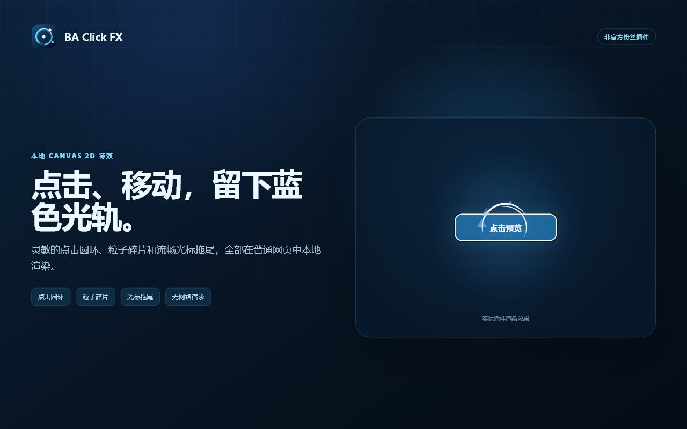

# BA Click FX Extension

为普通网页添加蔚蓝档案风格的点击圆环、粒子碎片和光标拖尾。基于 [ba-click-fx](https://github.com/CialloKing/ba-click-fx) 的 Manifest V3 浏览器扩展，支持 Chrome、Edge 和 Firefox。

[下载安装](#安装) · [使用说明](#使用) · [核心效果演示](https://ba-click-fx.cialloking.top/) · [更新记录](./CHANGELOG.md) · [反馈问题](https://github.com/CialloKing/ba-click-fx-extension/issues)



*历史商店宣传截图，展示 Canvas 2D 效果；当前默认使用完整 WebGL2。*

## 功能

- 安装后默认启用，点击特效和拖尾可分别开关，也可按网站禁用。
- 提供贴近原版、浅色背景优化、柔和、省电四种预设，可在弹窗和完整设置页切换。
- 完整设置支持颜色、透明度、尺寸、渲染模式、时间倍率，以及上游 Schema 的全部 66 项公开特效参数。
- 界面支持简体中文和英文，默认自动跟随浏览器语言；支持系统“减少动态效果”偏好。
- 特效在本地渲染，无遥测和远程代码；覆盖层不影响网页布局，也不拦截鼠标事件。
- 视觉偏好可通过浏览器同步；禁用的网站规则仅保存在本机。后台标签页释放渲染资源，切回时自动恢复。

## 安装

### Chrome / Edge

需要 Chrome / Edge 102 或更高版本。下载构建包无需安装 Node.js。

1. 打开 [最新 Release](https://github.com/CialloKing/ba-click-fx-extension/releases/latest)，下载文件名以 `-chromium.zip` 结尾的附件。
2. 将 ZIP 解压到固定目录。请使用浏览器构建包，GitHub 自动生成的 **Source code** 是源码。
3. 打开 `chrome://extensions/` 或 `edge://extensions/`，启用“开发者模式”。
4. 选择“加载已解压的扩展程序”，选中直接包含 `manifest.json` 的解压目录。
5. 打开或刷新普通 HTTP/HTTPS 网页，即可使用特效。

保留加载目录。更新时用新 Chromium 包替换该目录内容，在扩展管理页点击“重新加载”，再刷新网页。

### Firefox（临时安装）

需要 Firefox Desktop 140 或更高版本。下载构建包无需安装 Node.js。

1. 从 [最新 Release](https://github.com/CialloKing/ba-click-fx-extension/releases/latest) 下载以 `-firefox.zip` 结尾的附件；`-firefox-source.zip` 是审核用源码包。
2. 打开 `about:debugging#/runtime/this-firefox`，选择“临时载入附加组件”。
3. 选择下载的 Firefox ZIP，或解压后选择其中的 `manifest.json`。
4. 打开或刷新普通 HTTP/HTTPS 网页。

**临时安装会在重启 Firefox 后失效，需要重新加载。** 持久安装需要 Mozilla 签名的附加组件；Release 中的 ZIP 用于临时验证和提交审核。详见 [Mozilla 临时安装说明](https://extensionworkshop.com/documentation/develop/temporary-installation-in-firefox/)。

### 从源码构建

需要 Node.js 24 或更高版本。下载并解压[项目源码](https://github.com/CialloKing/ba-click-fx-extension/archive/refs/heads/main.zip)，在项目根目录打开终端：

```sh
npm ci
npm run build:all
```

- Chrome / Edge：按上面的加载步骤选择 `dist` 目录。
- Firefox：临时加载 `dist-firefox/manifest.json`。

更多命令见[开发与发布指南](./docs/development.md)。

## 使用

1. **点击网页**，显示圆环和粒子碎片。
2. **按住鼠标并移动**，显示拖尾。若希望普通移动时也显示，在扩展弹窗中开启“移动时始终显示”。
3. 点击浏览器工具栏中的扩展图标，切换效果、预设或当前网站开关，也可点击“预览点击特效”。
4. 选择“完整设置”，调整全部参数、语言和动态偏好，或搜索、移除和清空网站规则。

| 预设 | 适用场景 | 主要变化 |
| --- | --- | --- |
| 贴近原版（默认） | 日常使用 | 完整 WebGL2、默认蓝色与强度，使用 Screen 网页合成 |
| 浅色背景优化 | 白色或浅色网页上效果不明显 | 保留完整 WebGL2，调整覆盖方式以增强亮底可见度 |
| 柔和 | 希望效果更淡、更小 | 降低透明度和尺寸，使用 Canvas 2D 与原生辉光 |
| 省电 | 希望减少渲染开销 | 保留默认颜色和尺寸，降低透明度、渲染分辨率并使用原生辉光 |

预设统一应用外观、渲染模式、设备像素比上限（DPR）和合成方式；手动改变这些设置后会显示“自定义”。切换预设保留点击/拖尾开关、精细特效参数、时间倍率、HDR 展示参数及语言和动态偏好。完整参数映射见[预设与渲染指南](./docs/rendering-guide.md)。

## 常见问题与限制

### 安装或更新后没有特效

先刷新网页，再检查弹窗中的全局开关、当前网站开关和点击/拖尾开关。浏览器内部页面、扩展商店和部分内置 PDF 查看器禁止内容脚本运行，请在普通网页测试。

### 移动鼠标没有拖尾

默认仅按住鼠标移动时显示。启用“移动时始终显示”后，如果仍只有按住时出现，请检查完整设置中的动态偏好：启用“减少持续动态”，或跟随系统且系统要求减少动态时，会抑制持续移动拖尾，点击和按住拖动仍可用。

### 本地文件或嵌入区域没有效果

Chrome / Edge 的 `file://` 页面需在扩展详情中开启“允许访问文件网址”。扩展只注入顶层文档，嵌入式视频、编辑器或地图等 iframe 内部的操作不会触发特效。

### 网站禁用规则如何划分

HTTP/HTTPS 页面按 origin（协议、域名和端口）保存规则，同一 origin 下的路径共用开关；所有 `file://` 页面共用一条规则。规则只保存在本机，不随视觉偏好同步。

### 渲染模式与语言如何选择

默认使用完整 WebGL2，柔和/省电预设使用较轻量的渲染方式。实验性 WebGPU HDR 需在完整设置中手动选择，实际输出取决于浏览器和设备支持；详见[渲染与 HDR](./docs/rendering-guide.md#渲染模式与-hdr)。

语言选项中的“跟随系统”优先读取浏览器界面语言，再尝试浏览器语言偏好：中文使用简体中文，其他语言使用英文，检测失败回退中文。也可手动选择简体中文或 English。

## 权限与隐私

| 权限或访问范围 | 用途 |
| --- | --- |
| `storage` | 同步视觉、界面和动态偏好；在本机保存主动禁用的网站 origin |
| `activeTab` | 打开弹窗时识别当前网站，并向当前标签页发送用户请求的预览 |
| HTTP、HTTPS、file 内容脚本匹配 | 在允许的网页上自动接收指针事件并绘制特效 |

扩展只临时处理鼠标坐标和当前网站 origin，不读取网页正文、表单、密码或 Cookie，也不向开发者上传数据。扩展自身没有遥测、广告或网络请求；浏览器启用同步后，偏好设置可能由浏览器厂商同步，受浏览器同步设置和厂商政策约束。完整说明见[隐私政策](./PRIVACY.md)。

## 开发与发布

- [开发与发布指南](./docs/development.md)：环境、构建、检查、打包和核心依赖更新。
- [预设与渲染指南](./docs/rendering-guide.md)：API 参数映射、合成方式和 HDR 输出。
- [商店上架材料](./store-submission/README.md)：Chrome、Edge、Firefox 文案、权限理由、资源和发布清单。
- [Firefox 源码构建说明](./SOURCE_BUILD.md)：审核用源码包的重建步骤。

核心依赖通过 npm 精确锁定，并在构建时打入扩展，安装后无需 npm、CDN 或网络即可渲染。实际版本以 [package.json](./package.json) 和 [package-lock.json](./package-lock.json) 为准。

## Star 历史

[](https://github.com/CialloKing/ba-click-fx-extension/blob/star-history/stars.csv)

[查看 CSV 原始数据](https://github.com/CialloKing/ba-click-fx-extension/blob/star-history/stars.csv)。数据保存在独立的 `star-history` 分支，GitHub Actions 计划每天北京时间 03:17 更新。`reconstructed` 表示根据当前 Star 用户重建的历史，无法恢复已取消的 Star；`observed` 表示每日实测。漏跑日期保持缺失，不插值补齐。

## 项目说明与许可证

本项目主要通过 AI 生成和迭代完成（**绝无手写代码**）。这是非官方粉丝项目，与《蔚蓝档案》官方不存在隶属、合作或认可关系。

采用 [MIT License](./LICENSE)。特效核心的许可证与来源见 [THIRD_PARTY_NOTICES.md](./THIRD_PARTY_NOTICES.md)。
